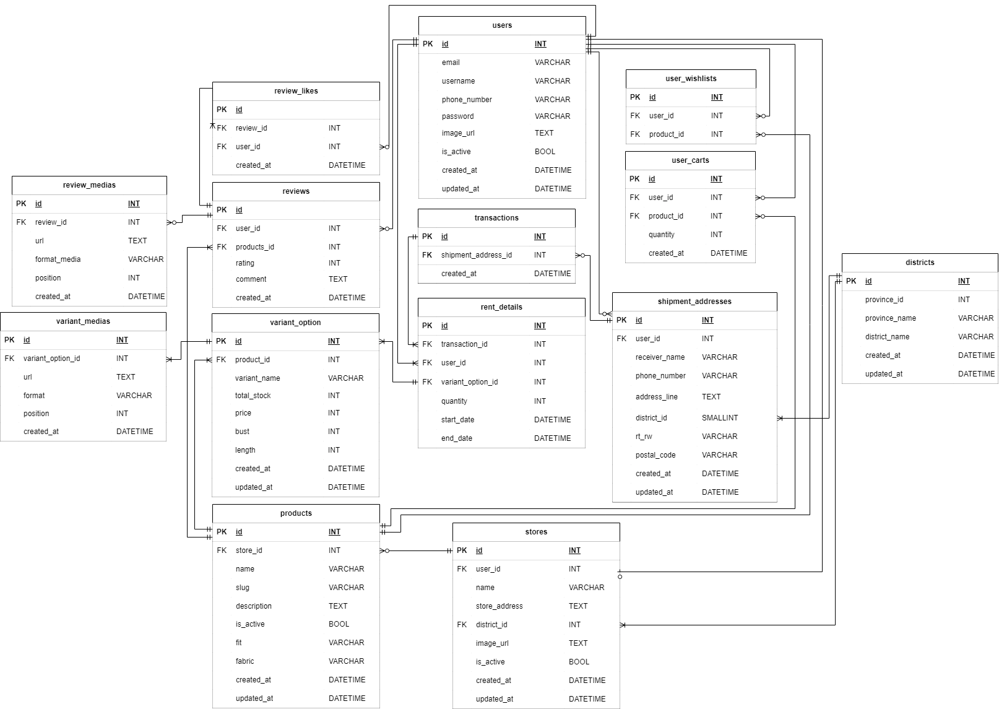

# WERENT Backend

WERENT is a backend service that supports property rental applications. It provides API functionalities for user management, property listings, booking services, and payment processing.

## Table of Contents

-   [Overview](#overview)
-   [ERD](#erd)
-   [Prerequisites](#prerequisites)
-   [Installation](#installation)
-   [Environment Variables](#environment-variables)
-   [Database Setup](#database-setup)
-   [Running the Application](#running-the-application)
-   [Stopping the Application](#stopping-the-application)
-   [Resetting the Application](#resetting-the-application)
-   [API Endpoints](#api-endpoints)
-   [API Documentation](#api-documentation)
-   [Deployment](#deployment)

## Overview

WERENT Backend is a Dockerized Flask application that interacts with a MySQL database to manage the platform's core functionalities. It supports migrations, user authentication, and data management for seamless operations.

## ERD

The Entity-Relationship Diagram (ERD) provides an overview of the database structure:



## Prerequisites

Ensure the following are installed on your system:

-   **Docker** (for containerized application setup)

## Installation

### Install Docker

To install Docker, follow the official guide for your operating system:

-   [Docker installation guide](https://docs.docker.com/get-docker/)

---

## Environment Variables

Create a `.env` file in the root directory of your project and configure the following variables:

```txt
SECRET_KEY=your_secret_key
MYSQL_USER=root
MYSQL_HOST=db
MYSQL_PORT=3306
MYSQL_DATABASE=db
MYSQL_PASSWORD=db
MYSQL_ROOT_PASSWORD=db
FLASK_ENV=development

AWS_ACCESS_KEY_ID=your_aws_access_key_id
AWS_SECRET_ACCESS_KEY=your_aws_secret_access_key
AWS_REGION_NAME=s3_bucket_region
AWS_BUCKET_NAME=s3_bucket_name
```

### Build the Application

Build the required Docker images:

```bash
docker-compose build --no-cache
```

## Start the Application

Run the following command to start the application:

```bash
docker-compose up
```

## Once the Application is Running

Once the application is running, visit [http://127.0.0.1:5000](http://127.0.0.1:5000).

---

## Stopping the Application

To stop the application gracefully, follow these steps:

1. Press `CTRL+C` to stop the process.
2. Run the following command to clean up containers:

```bash
docker-compose down
```

## Resetting the Application

If you encounter errors or need a fresh start, follow these steps:

1. Delete the `migrations` folder (if applicable).
2. Run the following command to remove all volumes, networks, and containers:

```bash
docker-compose down -v
```

3. Start the application with following command

```bash
docker-compose up
```

## API Endpoints

Below are the available API endpoints in the application:

### **Authentication**

-   `POST /api/v1/auth/login`: To login
-   `POST /api/v1/auth/refresh`: To obtain a new access token
-   `POST /api/v1/auth/register`: To register a new user
-   `DELETE /api/v1/users/me`: Too deactivate the user
-   `GET /api/v1/users/me`: To retrieve user information
-   ` PUT /api/v1/users/me`: To update the user's password

### **Products**

-   `GET /api/v1/products`: Retrieve all products
-   `GET /api/v1/products/{product_id}`: To retrieve details of a specific product
-   `GET /api/v1/products/{product_id}/reviews`: To retrieve all reviews for a specific product
-   `POST /api/v1/products/{product_id}/reviews: To create a review for a product
-   `POST /api/v1/reviews/{review_id}: To add a like to a review

## API Documentation

Detailed API documentation is available at:
[WERENT API Documentation](http://ec2-108-136-243-165.ap-southeast-3.compute.amazonaws.com/apidocs/#/)

---

## Notes

-   Changes to the code are automatically reflected in the Docker container if the app is running.
-   For accessing the database directly, use a tool like **DBeaver** with the following connection details:
    -   **Host**: `localhost`
    -   **Port**: `3307`
    -   **Database**: `db`
    -   **Username**: `root`
    -   **Password**: `db`

---
